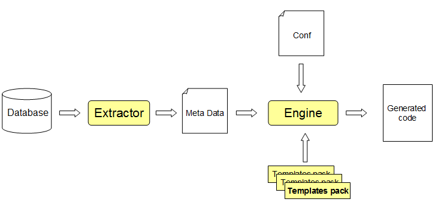

[ << prev ](index.html) [ index ](index.html) [ next >> ](installation.html)

1. Introduction
===============

* [Celerio](#celerio)
    * [Database Schema Extractor tool](#celerio-db-schema-extractor)
    * [Celerio Engine](#celerio-engine)
    * [Template packs](#celerio-template-packs)
* [When to use Celerio?](#when-to-use-celerio)
    * [Spread your best practice and architecture](#spread-best-practice)
    * [Application Rewriting](#application-rewritting)
    * [Rapid prototyping](#rapid-prototyping)
    * [New application](#new-application)
    * [Training](#training)
* [What to expect from Celerio?](#what-to-expect-from-celerio)

## Celerio

Celerio is a code generator designed to generate the foundation of data oriented applications.

Celerio is distributed as a Maven plugin which greatly eases its integration in your project development.

Celerio itself is written in Java. It executes generation templates that produce some source code:
Java files, XML files, etc. The generation templates are written in [Velocity](http://velocity.apache.org/).
Jaxio provides ready-to use templates so you can focus on real business needs but you may also creates
your own generation templates.

Celerio uses an entity-relationship model as a starting point. This model can be produced by any tool as long
as the tool respects Celerio's expected format. In practice Jaxio provides a tool that extracts an existing database
schema to produce the initial model. Of course this entity-relationship model can be refined by configuration.

Celerio is composed of three main components:

* a database schema extractor tool
* the core Celerio Engine
* some template packs.

### Database Schema Extractor tool

This tool reverses an existing database schema using the JDBC Meta Data API. It connects to your database,
and extracts the various meta-information such as tables' name, columns' name, constraints, relations, comments, etc.
The extraction result is written in an XML file. This tool runs in a read only mode, it does not read your real
data or modify your database.

### Celerio Engine

Celerio Engine relies on the raw entity-relationship model extracted by the database schema extractor tool and a
configuration file which instructs Celerio how to refine this model.

Indeed, the extracted model does not carry all the meta information, it is up to you to enrich it.

For example, through configuration, you may add inheritance to your model. From this enriched model, Celerio constructs
a graph into memory and let the generation templates access to it when it executes them.

### Template packs

The generation templates that Celerio executes are grouped into jar files called `templates packs`.

Jaxio provides some Open Source template packs, but again, you can write your own:

* backend templates: [https://github.com/jaxio/pack-backend-jpa](https://github.com/jaxio/pack-backend-jpa)
* frontend templates: [https://github.com/jaxio/pack-jsf2-spring-conversation](https://github.com/jaxio/pack-jsf2-spring-conversation)

Celerio loads all the template packs found on the classpath, so make sure you add them as jar dependencies when
executing Celerio.

By default Celerio executes all the templates found in a pack, but this can be configured to filter out certain templates.

The templates packs are regularly updated to take into account the latest industry standards and practices.
The current template packs generate some source code that uses the following frameworks or
standards: JSF2, SpringFramework, JPA2, Bean Validation, PrimeFaces, etc.

The generated source code follows industry standards and best practices. It is organized into a project structure
following the Maven conventions.

Celerio also uses some conventions. If you follow them, you can reduce the amount of configuration.

The Database Schema Extractor and Celerio Engine are distributed as Maven plugins, which simplifies their installation
and make them compatible with IDE that already support Maven integration. Eclipse, Netbeans and IntelliJ have
outstanding Maven support.

Celerio allows you to replace, skip, modify or extend the generated source code allowing you to use Celerio in
an iterative development.

*Last but not least, Celerio is not required at runtime. There is no lock-in.*

## When to use Celerio?

*Celerio targets applications that use a relational database and whose database schema is close to the domain layer*.
From there Celerio may be used for different purposes.

### Spread your best practice and architecture

New templates packs can be easily developed to take into account your in-house libraries and company best practices.
Once these packs are ready, they can be deployed as any other jar in your private Maven repository and be used by your
different teams to develop their applications based on your best practices and architecture.

### Application Rewriting

Deciding to rewrite an application in Java is a tough decision. There are often many risks. However, when your end
users ask for patches and features that you cannot deliver in time because of some some old code that nobody understand
anymore, you do not have many choices. But it is too much work, you would need a second team or more time, but there is
no budget for that.

Celerio helps your existing team to make the first move toward your application rewriting and support your team during
the application development cycle.

### Rapid prototyping

Writing a prototype for free is a common practice in the industry. You have to work fast, for free, and deliver top
notch quality to get the deal. Celerio increases drastically your chances to succeed, it gives you the possibility to
prototype extremely fast with no compromise on quality and architecture.

### New application

Writing an application from scratch is also possible with Celerio. Instead of designing your domain layer in Java,
you directly design you database schema.

### Training

Finally, the code generated by Celerio may be used as training material. The code is readable, well organized, unit
tested and documented. Developers should learn from it.

What to expect from Celerio?
----------------------------

You can expect a 30% gain on your application development.

However it is important to understand that Celerio is not here to replace your developers' brain. So do not count
on Celerio to do all the smart job. Instead Celerio is here to let your developers focus on the real value of your
final application. Celerio automates the tedious and repetitive task of writing the backbone of your Java project.

Not smart, but not dumb either, Celerio goes way beyond a simple copy paste. It covers subject such as persistence,
inheritance, 2d level cache, security, dependency injection, distribution, localization, unit tests, etc.
